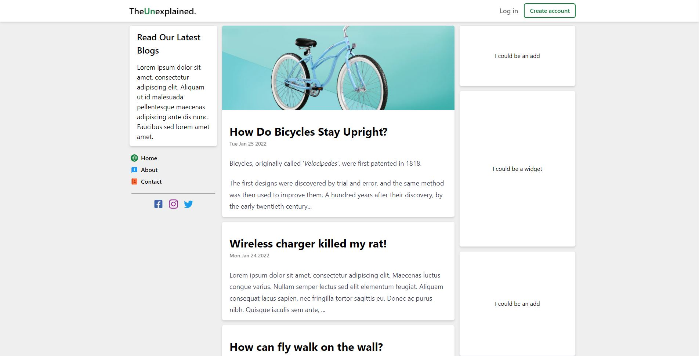
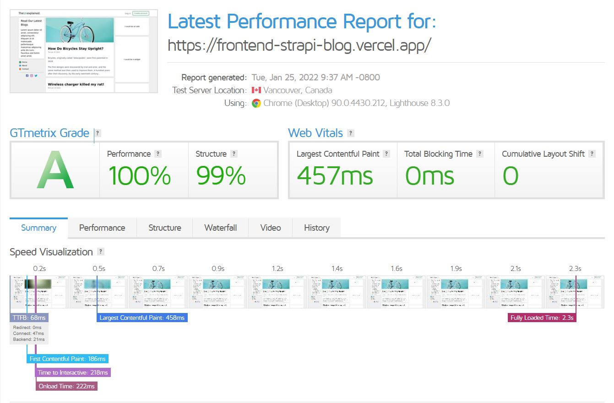

# TheUnexplained - Blog

> Blog template with headless CMS.
> Live demo [_here_](https://frontend-strapi-blog.vercel.app/).

## Table of Contents

- [General Info](#general-information)
- [Technologies Used](#technologies-used)
- [Features](#features)
- [Screenshots](#screenshots)
- [Project Status](#project-status)
- [Room for Improvement](#room-for-improvement)

## General Information

- NextJs blog website
- headless CMS
- Cloudinary

## Technologies Used

### Client

- @tailwindcss/typography: "^0.5.0",
- next: "12.0.8",
- next-compose-plugins: "^2.2.1",
- next-pwa: "^5.4.4",
- react: "17.0.2",
- react-dom: "17.0.2",
- react-icons: "^4.3.1",
- react-markdown: "^8.0.0"
- tailwindcss: "^3.0.15"

### Server

- Strapi headless CMS with Postgre

## Features

- Easily manage blogs through headless CMS
- PWA support
- Fully responsive

## Screenshots

## Project Status

Project is: _Complete_

## Room for Improvement

- Add authentification
